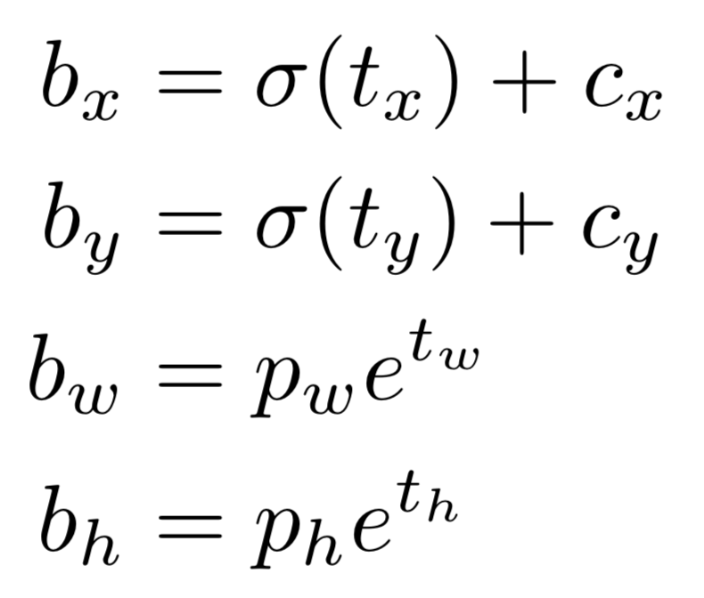

## Network Architecture

Yolo V3 is a Fully Connected Conv network. Various types of layers make the architecture of Yolo v3:

1. Convolutional Layer
2. Shortcut Layer
3. Upsampling Layer
4. Route Layer
5. Yolo Layer (the Detection Layer)

Following are some notes on the non self-explanatory layers of the network:

### Upsampling Layer
As the output of Yolo is in three different scales (refer to the Understanding Output Section), the size of feature map is reduced as the input passes through various layers. This layer helps us to increase the size of the feature map.

### Route Layer

The route layer
- is a mechanism to reuse feature map(s) either from a layer backwards in the network. For example, the current layer is 83rd, then the route layer allows you to reuse the feature map present in 79th layer (-4 layers from the current layer).
- or it allows you to combine feature maps from 2 layers of the network. For example, the current layer is [layer] and it allows us to concatenate layers from [layer] (-4 from the current) and 61st layer. The concatenation is done on the "channel" dimension. 

Apart from concatenation (if required), no other operation is carried out in the Route layer. The output of route layer is used as input for the next layer. 

### Yolo Layer
The output layer in Yolo v3 is a 1x1 convolutional layer, which means the output is a feature map.

## Config File
The network described above is captured in a configuration file saved in [assets](assets/) folder. This is the same [configuration file](https://github.com/pjreddie/darknet/blob/master/cfg/yolov3.cfg) as used by Joseph Redmon (the co-author of Yolo v3 research paper) in his implementation of the network. In our implementation, we use this file to create the network.

## Output

Yolo v3 detects objects on three 3 different scales. Each scale helps us detect objects of different sizes. The algorithm achieves this by downsizing the image by a factor of 32, 16, and 8 for each layer (the three Yolo layers in the config file). Each downsized representation of the image detects object(s) of different sizes.

In each output layer, the input image can be imagined as divided into a grid of "cells". As the output layer is a feature map, each cell is technically a neuron in the output layer. However, using the term cell helps us understand the output section better.

Each cell in the layer is capable of detecting three objects of different dimensions. The dimensions are loosely similar to the dimensions of pre-defined anchor boxes. The dimensions of these anchor boxes is determined by K-means clustering, a topic for another blog.

For each cell in the yolo layer, the output consists of:
- center coordinates (tx, ty) of the bounding box corresponding to the object. The top left corner of the grid item has coordinates 0,0; and the right bottom corner has coordinates as 1,1. This means the values of center coordinates lie between 0 and 1.
- coordinates (tw, th) that helps us calculate the width and height of the bounding box according to the formula given below
- objectness score (p0): the probability of having an object in the given cell
- confidence score(s) corresponding to each class (p1, p2, p3...pn): the probability of the object belonging to a given class.

Assuming that the algorithm predicts B bounding boxes per cell and has been trained on C different classes, the number of output coordinates corresponding to each cell would be:

>> B * (5 + C)

The network trained by the authors, weights of which are widely used in follow-up implementations, had 80 classes and 3 Bounding boxes. This means, the total number of coordinates corresponding to each cell would be 255.

### Structure
The following diagram gives a glimpse of how an image is divided into a grid and how the output can be visualized.

In the input image, the cell highlighted by the red square is responsible for detecting the object (the dog in this case). 
Let's assume that the brown cuboid is the feature map in the yolo layer. This cuboid is the output for the entire image. The red section in the cuboid represents the output for the red cell. Box 1, Box 2, and Box 3 are the sub-sections corresponding to the three bounding boxes for this cell, each having 85 coordinates each. 

### Calculations - Theoritical

The final calculations are given as: 

**Center Coordinates**: As mentioned above, the coordinates output in the boudning box are local to that particular box. To calculate the absolute values of the center coordinates, we'll have to add the relevant offsets (**cx** and **cy**) in our final calculations.  

**Width and Height**: **pw** and **ph** are the values provided in the configuration file. These correspond the width and height of the anchor boxes. After the above calculation, the width and height of the bounding box are obtained for a particular object.

### Calculations - Implementation

#### NMS
#### IoU
#### Flattening

   

# ToDos: 
1. Second bullet point in Route layer
2. Hyperlink in upsamling layer
3. Explain parameters of layers in the config file

